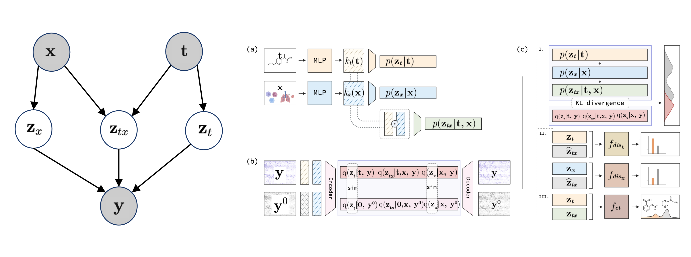

# Learning Identifiable Factorized Causal Representations of Cellular Responses

[OpenReview](https://openreview.net/forum?id=AhlaBDHMQh) |
[arXiv](https://arxiv.org/abs/***) |
[BibTeX](#bibtex)

<p align="center">
    
</p>

Official code for the NeurIPS 2024 paper [ Learning Identifiable Factorized Causal Representations of Cellular Responses](https://openreview.net/forum?id=AhlaBDHMQh). This work was performed by
[Haiyi Mao](https://harrymao1011.github.io/),
[Romain Lopez](https://romain-lopez.github.io/),
[Kai Liu](),
[Jan-Christian H\"{u}tter](https://www.jchuetter.com/),
[David Richmond](),
[Panayiotis (Takis) Benos](),
[Lin Qiu](https://lquvatexas.github.io/),
Please [cite us](#bibtex) when making use of our code or ideas.

## Installation
<p align="left">
    <a href="https://www.python.org/downloads/"></a>
    <a href="https://pytorch.org/get-started/previous-versions/"></a>
    <a href="https://black.readthedocs.io/en/stable/"></a>
    <a href="https://anaconda.org/anaconda/conda"></a>
</p>

```shell
cd $PROJECT_DIR
conda config --append channels conda-forge
conda create -n fcr-env --file requirements.txt
conda activate fcr-env
```

## Data Availability

# sciPlex: https://www.science.org/doi/10.1126/science.aax6234
# multiPlex: https://www.nature.com/articles/s41467-020-17440-w


## Run
```shell
# train
./main.sh &
test_sciPlex.ipynb contains the steps to perform the analysis
```

## BibTex

```bibtex
@inproceedings{
mao2024learning,
title={Learning Identifiable Factorized Causal Representations of Cellular Responses},
author={Haiyi Mao and Romain Lopez and Kai Liu and Jan-Christian Huetter and David Richmond and Panayiotis V. Benos and Lin Qiu},
booktitle={Advances in Neural Information Processing Systems},
year={2024},
note={\url{https://github.com/Genentech/fcr}
}

